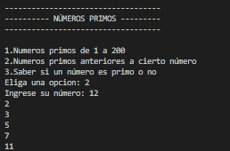

## Programa independiente #1

Hacer un programa que cuente todos los números primos de 1 a 200, que imprima los primos anteriores a cierto número y que diga si cierto número es primo o no

## Pantallazos

